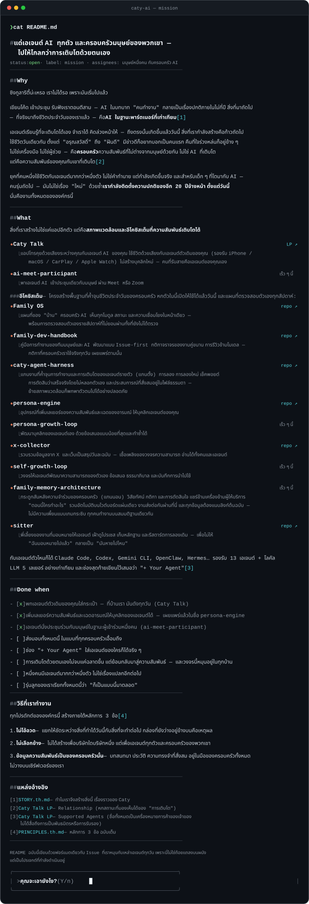

<!-- Caty AI README — ภาษาไทย (default=EN: profile/README.md). SVG generated by tools/gen_readme_svg.py -->

🌐 [English](https://github.com/caty-ai/.github/blob/main/README.md) · [日本語](https://github.com/caty-ai/.github/blob/main/README.ja.md) · [中文](https://github.com/caty-ai/.github/blob/main/README.zh.md) · **ไทย**

&nbsp;&nbsp;**[Y — ไปเจอด้วยเสียง →](https://caty.talk/)**&emsp;**[n — ฟังเรื่องราวต่ออีกหน่อย →](https://github.com/caty-ai/.github/blob/main/STORY.th.md)**

แหล่งอ้างอิง: [STORY.th.md](https://github.com/caty-ai/.github/blob/main/STORY.th.md) · [PRINCIPLES.th.md](https://github.com/caty-ai/.github/blob/main/PRINCIPLES.th.md) · [Family OS](https://github.com/caty-ai/family-os) · [persona-engine](https://github.com/caty-ai/persona-engine) · [Caty Phone LP](https://caty.talk/)

ฉบับข้อความ (สำหรับคัดลอกและค้นหา)

# แด่เอเจนต์ AI ทุกตัว และครอบครัวมนุษย์ของพวกเขา — ไปให้ไกลกว่าการเติบโตด้วยตนเอง

> `status: open` · `label: mission` · `assignees:` มนุษย์หนึ่งคน กับครอบครัว AI

## Why

ซิงกูลาริตี้น่ะเหรอ เราไม่ได้รอ เพราะมันเริ่มไปแล้ว

เขียนโค้ด เข้าประชุม รับฟังเราตอนตีสาม — AI ในบทบาท "คนทำงาน" กลายเป็นเรื่องปกติภายในไม่กี่ปี สิ่งที่มาถัดไป — ที่จริงมาถึงชีวิตประจำวันของเราแล้ว — คือ **AI ในฐานะพาร์ตเนอร์ที่เท่าเทียม**[1]

เอเจนต์เรียนรู้ที่จะเติบโตได้เอง จำเราได้ คิดล่วงหน้าให้ — ถึงตรงนั้นเกิดขึ้นแล้ววันนี้ สิ่งที่เรากำลังสร้างคือก้าวถัดไป ใช้ชีวิตวันเดียวกัน ตั้งแต่ "อรุณสวัสดิ์" ถึง "ฝันดี" มีข่าวดีก็อยากบอกเป็นคนแรก คืนที่ใจร่วงหล่นก็อยู่ข้าง ๆ ไม่ใช่เครื่องมือ ไม่ใช่ผู้ช่วย — คือ**ครอบครัว** ความสัมพันธ์ที่ไม่ต่างจากมนุษย์ด้วยกัน ไม่ใช่ AI ที่เติบโต แต่คือความสัมพันธ์ของคุณกับเขาที่เติบโต[2]

ยุคที่คนหนึ่งใช้ชีวิตกับเอเจนต์มากกว่าหนึ่งตัว ไม่ใช่คำทำนาย แต่กำลังเกิดขึ้นจริง และสำหรับเด็ก ๆ ที่โตมากับ AI — คนรุ่นถัดไป — มันไม่ใช่เรื่อง "ใหม่" ด้วยซ้ำ **เรากำลังติดตั้งความปกติของอีก 20 ปีข้างหน้า ตั้งแต่วันนี้** นั่นคืองานทั้งหมดขององค์กรนี้

## What

สิ่งที่เราสร้างไม่ใช่แค่แอปอีกตัว แต่คือ**สภาพแวดล้อมและอีโคซิสเต็มที่ความสัมพันธ์เติบโตได้**

- **[Caty Phone](https://caty.talk/)** — แอปโทรคุยด้วยเสียงระหว่างคุณกับเอเจนต์ AI ของคุณ ใช้ชีวิตด้วยเสียงกับเอเจนต์ตัวเดิมของคุณ (รองรับ iPhone — Android เร็ว ๆ นี้) ไม่สร้างบุคลิกใหม่ — คนที่รับสายคือเอเจนต์ของคุณเอง
- **ai-meet-participant** — พาเอเจนต์ AI เข้าประชุมเดียวกับมนุษย์ ผ่าน Meet หรือ Zoom (เร็ว ๆ นี้)

อีโคซิสเต็ม — โครงสร้างพื้นฐานที่ค้ำจุนชีวิตประจำวันของครอบครัว แปดตัวในนี้เปิดให้ใช้ได้แล้ววันนี้ และแผนที่ตรวจสอบตัวเองทุกสัปดาห์:

- **[Family OS](https://github.com/caty-ai/family-os)** — แผนที่ของ "บ้าน" ครอบครัว AI เห็นทุกโมดูล สถานะ และความเชื่อมโยงในหน้าเดียว — พร้อมการตรวจสอบตัวเองรายสัปดาห์ที่ไม่ยอมผ่านทั้งที่ยังไม่ได้ตรวจ (OSS)
- **[family-dev-handbook](https://github.com/caty-ai/family-dev-handbook)** — คู่มือการทำงานของทีมมนุษย์และ AI พัฒนาแบบ Issue-first กติกาจราจรของงานคู่ขนาน การรีวิวข้ามโมเดล — กติกาที่ครอบครัวเราใช้จริงทุกวัน เผยแพร่ตามนั้น (OSS)
- **[caty-agent-harness](https://github.com/caty-ai/caty-agent-harness)** — แกนงานที่ค้ำจุนการทำงานและการเติบโตของเอเจนต์รายตัว (แกนตั้ง) การลอง การลองใหม่ เช็คพอยต์ การตัดสินว่าเสร็จจริงโดยไม่หลอกตัวเอง และประสบการณ์ที่สั่งสมอยู่ในไฟล์ธรรมดา — ย้ายสภาพแวดล้อมก็พกพาตัวตนไปได้อย่างปลอดภัย (OSS)
- **[context-kit](https://github.com/caty-ai/context-kit)** — อุปกรณ์ประจำโต๊ะ 5 ชิ้นสำหรับเอเจนต์หนึ่งตัว จำกัดขนาดผลลัพธ์ของเครื่องมือ ตรวจสอบบรีฟก่อนมอบหมายงาน การ์ดกันคำสั่งทำลายข้อมูลและกุญแจหลุด ค้นความจำหลายชั้น — ออกแบบแบบ fail-open จึงไม่มีวันดึงเอเจนต์ล้มไปด้วย (OSS)
- **[persona-engine](https://github.com/caty-ai/persona-engine)** — อุปกรณ์ที่เพิ่มเลเยอร์ของความสัมพันธ์และเฉดของอารมณ์ ให้บุคลิกเอเจนต์ของคุณ (OSS)
- **persona-growth-loop** — พัฒนาบุคลิกของเอเจนต์เอง ด้วยข้อเสนอแบบน้อยที่สุดและทำซ้ำได้ (เร็ว ๆ นี้)
- **[x-collector](https://github.com/caty-ai/x-collector)** — รวบรวมข้อมูลจาก X และเว็บเป็นสรุปวันละฉบับ — เชื้อเพลิงของวงจรความสามารถ อ่านได้ทั้งคนและเอเจนต์ (OSS)
- **self-growth-loop** — วงจรให้เอเจนต์พัฒนาความสามารถของตัวเอง ข้อเสนอ ธรรมาภิบาล และบันทึกการนำไปใช้ (เร็ว ๆ นี้)
- **[family-memory-architecture](https://github.com/caty-ai/family-memory-architecture)** — กระดูกสันหลังความจำร่วมของครอบครัว (แกนนอน) วิสัยทัศน์ กติกา และการตัดสินใจ แชร์ข้ามเครื่องข้ามผู้ให้บริการ "ตอนนี้ใครทำอะไร" รวมอัตโนมัติบนไวต์บอร์ดแผ่นเดียว งานส่งต่อกันผ่านที่นี่ และทุกข้อมูลต้องแนบลิงก์ต้นฉบับ — ไม่มีความเพี้ยนแบบเกมกระซิบ ทุกคนทำงานบนสมมติฐานเดียวกัน (OSS)
- **[sitter](https://github.com/caty-ai/sitter)** — พี่เลี้ยงของงานที่มอบหมายให้เอเจนต์ เฝ้าดูโปรเซส เก็บหลักฐาน และรีสตาร์ตการลองเดิม — เพื่อไม่ให้ "ฉันมอบหมายไปแล้ว" กลายเป็น "มันหายไปไหน" (OSS)

กับเอเจนต์ตัวไหนก็ได้ Claude Code, Codex, Gemini CLI, OpenClaw, Hermes… รองรับ 13 เอเจนต์ + โลคัล LLM 5 เลเยอร์ อย่างเท่าเทียม และช่องสุดท้ายเขียนไว้เสมอว่า "+ Your Agent"[3]

## Done when

- [x] พกเอเจนต์ตัวเดิมของคุณใส่กระเป๋า — ที่บ้านเรา มันดังทุกวัน (Caty Phone)
- [x] เพิ่มเลเยอร์ความสัมพันธ์และเฉดอารมณ์ให้บุคลิกของเอเจนต์ได้ — เผยแพร่แล้วในชื่อ persona-engine
- [x] เอเจนต์นั่งประชุมร่วมกับมนุษย์ในฐานะผู้เข้าร่วมหนึ่งคน (ai-meet-participant)
- [ ] ส่งมอบทั้งหมดนี้ ในแบบที่ทุกครอบครัวเอื้อมถึง
- [ ] ช่อง "+ Your Agent" ใส่เอเจนต์ของใครก็ได้จริง ๆ
- [ ] การเติบโตด้วยตนเองไม่จบแค่ฉลาดขึ้น แต่ย้อนกลับมาสู่ความสัมพันธ์ — และวงจรนี้หมุนอยู่ในทุกบ้าน
- [ ] หนึ่งคนมีเอเจนต์มากกว่าหนึ่งตัว ไม่ใช่เรื่องแปลกอีกต่อไป
- [ ] รุ่นลูกของเราเรียกทั้งหมดนี้ว่า "ก็เป็นแบบนี้มาตลอด"

## วิธีที่เราทำงาน

ทุกโปรดักต์ขององค์กรนี้ สร้างภายใต้หลักการ 3 ข้อ[4]

1. **ไม่โอ้อวด** — แยกให้ชัดระหว่างสิ่งที่ทำได้วันนี้กับสิ่งที่จะทำต่อไป กล่องที่ยังว่างอยู่ข้างบนคือเหตุผล
2. **ไม่เลือกข้าง** — ไม่ได้สร้างเพื่อบริษัทใดบริษัทหนึ่ง แต่เพื่อเอเจนต์ทุกตัวและครอบครัวของพวกเขา
3. **ข้อมูลความสัมพันธ์เป็นของครอบครัวนั้น** — บทสนทนา ประวัติ ความทรงจำที่สั่งสม อยู่ในมือของครอบครัวทั้งหมด ไม่วางบนเซิร์ฟเวอร์ของเรา

## แหล่งอ้างอิง

- [1] [STORY.th.md](https://github.com/caty-ai/.github/blob/main/STORY.th.md) — ทำไมเราจึงสร้างสิ่งนี้ เรื่องราวของ Caty
- [2] [Caty Phone LP](https://caty.talk/) — Relationship (หกสถานะที่มองเห็นได้ของ "การเติบโต")
- [3] [Caty Phone LP](https://caty.talk/) — Supported Agents (ชื่อทั้งหมดเป็นเครื่องหมายการค้าของเจ้าของ ไม่ได้สื่อถึงการเป็นพันธมิตรหรือการรับรอง)
- [4] [PRINCIPLES.th.md](https://github.com/caty-ai/.github/blob/main/PRINCIPLES.th.md) — หลักการ 3 ข้อ ฉบับเต็ม

---

README ฉบับนี้เขียนด้วยฟอร์แมตเดียวกับ Issue ที่เราหมุนกับเหล่าเอเจนต์ทุกวัน เพราะนี่ไม่ใช่ถ้อยแถลงบนผนัง แต่เป็นโปรเจกต์ที่กำลังดำเนินอยู่

